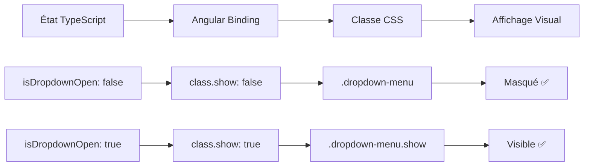

# 🐛 Correction du Problème des Dropdowns - Documentation

## 🚨 Problème Identifié

**Symptôme :** Les dropdowns "Catégories" et "Marques" restaient ouverts au chargement du site, malgré les modifications TypeScript.

**Cause Racine :** Erreur dans le CSS du fichier `navbar.component.css`

## 🔍 Analyse Technique

### ❌ **Code CSS Problématique (AVANT)**

```css
.dropdown-menu {
  /* ... autres propriétés ... */
  opacity: 1;           /* ← PROBLÈME : Toujours visible */
  visibility: visible;  /* ← PROBLÈME : Toujours affiché */
  transform: translateY(0);
  transition: all 0.3s ease;
}

.dropdown-menu.show {
  opacity: 1;
  visibility: visible;
  transform: translateY(0);
}
```

**🔥 Problème :** 
- La classe `.dropdown-menu` avait `opacity: 1` et `visibility: visible` **par défaut**
- Même sans la classe `.show`, les dropdowns étaient visibles
- La logique TypeScript (`isDropdownOpen = false`) était **ignorée** par le CSS

---

## ✅ **Solution Appliquée**

### 🎯 **Code CSS Corrigé (APRÈS)**

```css
.dropdown-menu {
  /* ... autres propriétés ... */
  /* CORRECTION : Masqué par défaut */
  opacity: 0;                    /* ← NOUVEAU : Invisible par défaut */
  visibility: hidden;            /* ← NOUVEAU : Masqué par défaut */
  transform: translateY(-10px);  /* ← AMÉLIORATION : Animation d'entrée */
  transition: all 0.3s ease;
}

/* État ouvert : Contrôlé par Angular */
.dropdown-menu.show {
  opacity: 1;                    /* Visible quand classe 'show' ajoutée */
  visibility: visible;           /* Affiché quand classe 'show' ajoutée */
  transform: translateY(0);      /* Position finale avec animation */
}
```

---

## 🔧 **Fichiers Modifiés**

### 📄 `navbar.component.css` (lignes ~85-105)

**🔹 Changements CSS :**
1. **État par défaut** : `opacity: 0` + `visibility: hidden`
2. **Animation améliorée** : `transform: translateY(-10px)` → glissement du haut
3. **Commentaires explicatifs** ajoutés pour éviter régression future

**🔹 Logique de fonctionnement :**
```
État initial (au chargement) :
├── isDropdownOpen = false (TypeScript)
├── [class.show]="false" (Angular)
├── .dropdown-menu sans classe .show (HTML)
└── opacity: 0, visibility: hidden (CSS) ✅ MASQUÉ

État après clic :
├── isDropdownOpen = true (TypeScript)
├── [class.show]="true" (Angular)  
├── .dropdown-menu.show (HTML)
└── opacity: 1, visibility: visible (CSS) ✅ VISIBLE
```

---

## 🧪 **Tests de Validation**

### ✅ **Comportements Attendus**
- [ ] **Chargement initial** : Aucun dropdown visible
- [ ] **Clic sur "Catégories"** : Dropdown catégories s'ouvre avec animation
- [ ] **Re-clic sur "Catégories"** : Dropdown se ferme avec animation
- [ ] **Clic sur "Marques"** : Dropdown marques s'ouvre, catégories se ferme
- [ ] **Clic extérieur** : Tous les dropdowns se ferment
- [ ] **Animation fluide** : Transition de 0.3s entre états

### 🎯 **Points de Vérification**
1. **Au chargement** : `isDropdownOpen = false` → CSS `opacity: 0`
2. **Après clic** : `isDropdownOpen = true` → CSS `opacity: 1`
3. **Cohérence** : État TypeScript = État CSS

---

## 🔄 **Chaîne de Responsabilité**



---

## 🚀 **Améliorations Apportées**

### 🎨 **Animation Améliorée**
- **Effet de glissement** : `translateY(-10px)` → `translateY(0)`
- **Transition fluide** : 0.3s pour tous les changements
- **Expérience utilisateur** : Apparition naturelle du haut vers le bas

### 🧹 **Code Plus Robuste**
- **État par défaut explicite** : Pas d'ambiguïté visuelle
- **Commentaires préventifs** : Évite les futures régressions
- **Logique claire** : TypeScript contrôle → CSS applique

---

## 📝 **Leçon Apprise**

**⚠️ Important :** Même avec une logique TypeScript/Angular correcte, le CSS peut "outrepasser" l'état voulu si les valeurs par défaut ne sont pas cohérentes.

**🎯 Principe :** Toujours vérifier que :
1. **État initial TypeScript** : `property = false`
2. **État initial CSS** : Cohérent avec `false` (masqué)
3. **État activé CSS** : Cohérent avec `true` (visible)

---

## 🔧 **Résolution Future**

Pour éviter ce type de problème :
1. **Tester visuellement** après chaque modification CSS/TypeScript
2. **Utiliser des classes CSS explicites** (`.hidden`, `.visible`)
3. **Commenter les états par défaut** dans le CSS
4. **Valider la cohérence** entre logique et affichage
