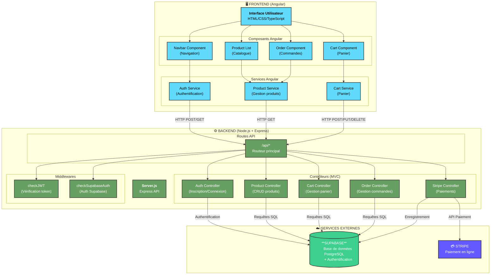
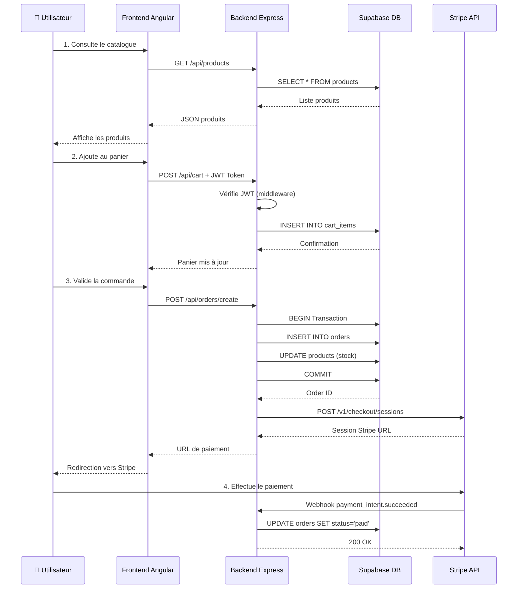
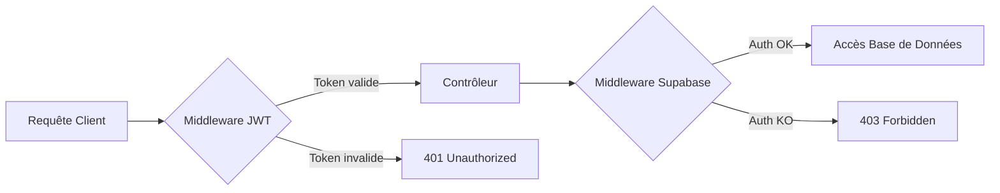
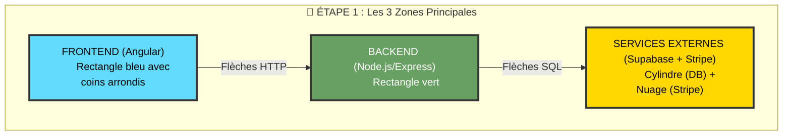
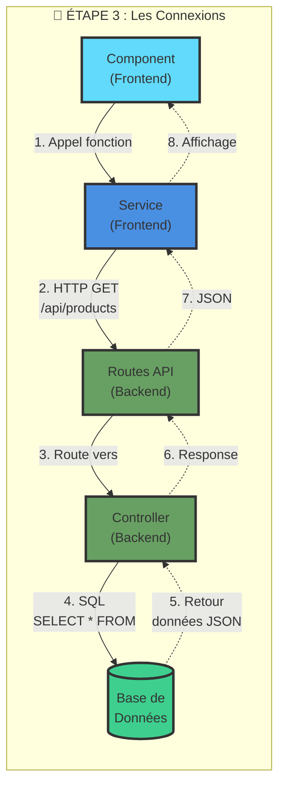
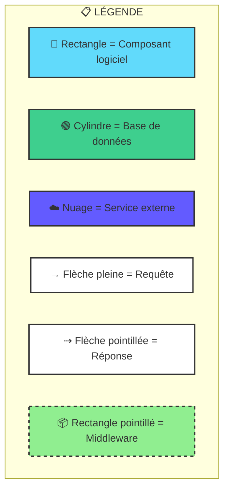

# Diagramme d'Architecture - Soundora
## Pour Jury DWWM (Développeur Web et Web Mobile)

---

## 🎯 Type de Diagramme : **Diagramme d'Architecture Applicative**
(Aussi appelé : Diagramme de composants / Diagramme de déploiement)

---

## 📐 Légende des Formes Géométriques à Utiliser

### Pour un diagramme papier/PowerPoint :

| Forme | Élément | Utilisation |
|-------|---------|-------------|
| **Rectangle** | Composant logiciel | Frontend, Backend, Services |
| **Rectangle avec coins arrondis** | Interface utilisateur | Pages, vues, composants Angular |
| **Cylindre** | Base de données | Supabase (PostgreSQL) |
| **Nuage** | Service externe / API | Stripe, services tiers |
| **Flèche simple →** | Flux de données / Appel API | Requête HTTP |
| **Flèche double ↔** | Communication bidirectionnelle | WebSocket, temps réel |
| **Rectangle en pointillés** | Module / Groupe logique | Groupement de fonctionnalités |

---

## 📊 Architecture Soundora - Vue d'ensemble



---

## 🔄 Flux de Données Détaillé - Exemple : Acheter un Produit



---

## 🗂️ Architecture MVC dans Soundora

### **Modèle (Model)** - Les Données
```
📁 Supabase (PostgreSQL)
├── Table: products (produits)
├── Table: users (utilisateurs)
├── Table: orders (commandes)
├── Table: cart_items (panier)
├── Table: categories (catégories)
└── Table: brands (marques)
```

### **Vue (View)** - L'Interface
```
📁 soundora-frontend/src/app/components/
├── navbar.component.html/css/ts
├── product-list.component.html/css/ts
├── cart.component.html/css/ts
└── order.component.html/css/ts
```

### **Contrôleur (Controller)** - La Logique Métier
```
📁 soundora-backend/controllers/
├── authController.js (authentification)
├── productSupabaseController.js (produits)
├── cartController.js (panier)
├── orderController.js (commandes)
└── stripeController.js (paiements)
```

---

## 🔐 Sécurité et Middlewares



---

## 📦 Technologies Utilisées

### Frontend
- **Framework** : Angular 18+
- **Langage** : TypeScript
- **Styles** : CSS3
- **HTTP Client** : HttpClient Angular

### Backend
- **Runtime** : Node.js
- **Framework** : Express.js
- **Langage** : JavaScript (ES Modules)
- **API REST** : Architecture RESTful

### Base de Données
- **BaaS** : Supabase (Backend as a Service)
- **SGBD** : PostgreSQL
- **Auth** : Supabase Auth (JWT)

### Services Externes
- **Paiement** : Stripe API
- **Email** : Nodemailer (si configuré)

---

## 🎨 Comment Dessiner ce Diagramme à la Main

### Étape 1 : Tracer les 3 grandes zones

**Instructions** : Dessiner 3 rectangles empilés verticalement avec des espaces entre eux



**À dessiner** :
- Rectangle 1 (haut) : `FRONTEND` - coins arrondis, couleur bleue
- Rectangle 2 (milieu) : `BACKEND` - coins carrés, couleur verte
- Rectangle 3 (bas) : `SERVICES EXTERNES` - formes mixtes (cylindre + nuage)
- Flèches : du haut vers le bas avec annotations "HTTP" et "SQL"

---

### Étape 2 : Ajouter les sous-composants

**Instructions** : À l'intérieur de chaque zone, dessiner des petits rectangles

```mermaid
graph TB
    subgraph Frontend["🔵 FRONTEND (Angular)"]
        C1["Navbar
        Component"]
        C2["Product List
        Component"]
        C3["Cart
        Component"]
        S1["Product
        Service"]
        S2["Auth
        Service"]
    end
    
    subgraph Backend["🟢 BACKEND (Node.js/Express)"]
        CTRL1["Auth
        Controller"]
        CTRL2["Product
        Controller"]
        CTRL3["Cart
        Controller"]
        CTRL4["Order
        Controller"]
        CTRL5["Stripe
        Controller"]
        MW["Middlewares
        (pointillés)"]
    end
    
    subgraph Services["☁️ SERVICES EXTERNES"]
        DB[("Supabase
        PostgreSQL")]
        PAY["💳 Stripe"]
    end
    
    Frontend --> Backend
    Backend --> Services
    
    style C1 fill:#61DAFB,stroke:#333,stroke-width:2px
    style C2 fill:#61DAFB,stroke:#333,stroke-width:2px
    style C3 fill:#61DAFB,stroke:#333,stroke-width:2px
    style S1 fill:#4A90E2,stroke:#333,stroke-width:2px
    style S2 fill:#4A90E2,stroke:#333,stroke-width:2px
    
    style CTRL1 fill:#68A063,stroke:#333,stroke-width:2px
    style CTRL2 fill:#68A063,stroke:#333,stroke-width:2px
    style CTRL3 fill:#68A063,stroke:#333,stroke-width:2px
    style CTRL4 fill:#68A063,stroke:#333,stroke-width:2px
    style CTRL5 fill:#68A063,stroke:#333,stroke-width:2px
    style MW fill:#90EE90,stroke:#333,stroke-width:2px,stroke-dasharray: 5 5
    
    style DB fill:#3ECF8E,stroke:#333,stroke-width:2px
    style PAY fill:#635BFF,stroke:#333,stroke-width:2px
```



**À dessiner dans chaque zone** :
- **FRONTEND** : 3 rectangles "Components" + 2 rectangles "Services"
- **BACKEND** : 5 rectangles "Controllers" + 1 rectangle en pointillés "Middlewares"
- **SERVICES** : 1 cylindre "Supabase" + 1 nuage "Stripe"

---

### Étape 3 : Tracer les flèches avec annotations

**Instructions** : Relier les composants avec des flèches annotées



**Types de flèches à dessiner** :
- **Flèches pleines épaisses** (→) : Requêtes aller (Frontend → Backend)
- **Flèches pointillées** (⇢) : Réponses retour (Backend → Frontend)
- **Annotations** : écrire à côté de chaque flèche :
  - "HTTP GET /api/products"
  - "SQL SELECT"
  - "JSON Response"

---

### Étape 4 : Ajouter la légende

**Instructions** : En bas à droite du diagramme, créer un petit tableau de légende



**À dessiner comme légende** :
| Forme | Signification |
|-------|---------------|
| Rectangle bleu | Frontend (Angular) |
| Rectangle vert | Backend (Node.js) |
| Cylindre | Base de données |
| Nuage | Service externe (API) |
| Rectangle pointillé | Middleware/Sécurité |
| → (pleine) | Flux de requête |
| ⇢ (pointillée) | Flux de réponse |

---

## 💡 Points Clés à Expliquer au Jury

1. **Séparation des responsabilités** : Frontend (présentation) ≠ Backend (logique) ≠ BDD (données)
2. **Architecture RESTful** : API REST avec routes claires (/api/products, /api/orders...)
3. **Sécurité** : JWT pour authentification + middlewares de vérification
4. **MVC côté Backend** : Routes → Controllers → Models (Supabase)
5. **Componentisation Frontend** : Angular avec composants réutilisables
6. **Services externes** : Intégration Stripe (paiement) + Supabase (BDD managée)

---

## 📄 Exemple de Dialogue avec le Jury

**Jury** : "Pouvez-vous nous expliquer l'architecture de votre application ?"

**Vous** : "Bien sûr ! Mon application Soundora suit une **architecture client-serveur en 3 tiers** :

1. **Le Frontend en Angular** qui gère l'interface utilisateur avec des composants réutilisables (navbar, liste produits, panier...)

2. **Le Backend en Node.js/Express** qui expose une API REST. J'ai appliqué le pattern **MVC** : les routes reçoivent les requêtes, les controllers traitent la logique métier, et Supabase gère les données.

3. **La base de données PostgreSQL** via Supabase, qui fournit aussi l'authentification JWT.

Pour la sécurité, j'utilise des **middlewares** qui vérifient le token JWT avant d'accéder aux ressources protégées. Les paiements sont gérés via l'**API Stripe** avec un système de webhooks pour confirmer les transactions."

---

## 📌 Fichiers de Référence

- **Backend principal** : `/soundora-backend/server.js`
- **Routes API** : `/soundora-backend/routes/api.js`
- **Contrôleurs** : `/soundora-backend/controllers/`
- **Frontend principal** : `/soundora-frontend/src/app/`
- **Composants Angular** : `/soundora-frontend/src/app/components/`

---

**Date de création** : Janvier 2026  
**Auteur** : Bastien - Projet DWWM  
**Application** : Soundora - E-commerce d'instruments de musique
